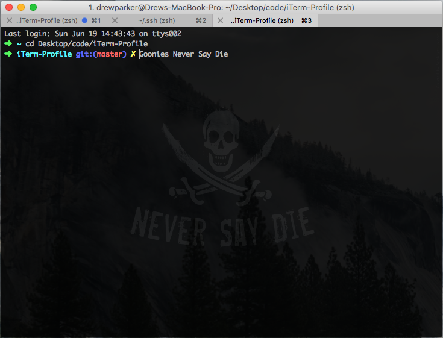

# Goonies iTerm2

# 


Goonies fans will agree, this Goonies inspired iTerm2 profile is bad-ass. 


## Required

*1. Download [iTerm2](https://github.com/sindresorhus/pageres-cli) as a replacement for Terminal. iTerm2 brings the terminal into the modern age with features you never knew you always wanted.*

*2. Install [Oh-My-Zsh](http://ohmyz.sh/) which is an open source, community-driven framework for managing your ZSH configuration. It comes bundled with a ton of helpful functions, helpers, plugins, themes, and a few things that make you shout...*

```
$ sh -c "$(curl -fsSL https://raw.github.com/robbyrussell/oh-my-zsh/master/tools/install.sh)"
```


## License

Hey, you guuuys! It's free, but first, you gotta do the truffle shuffle.

# 